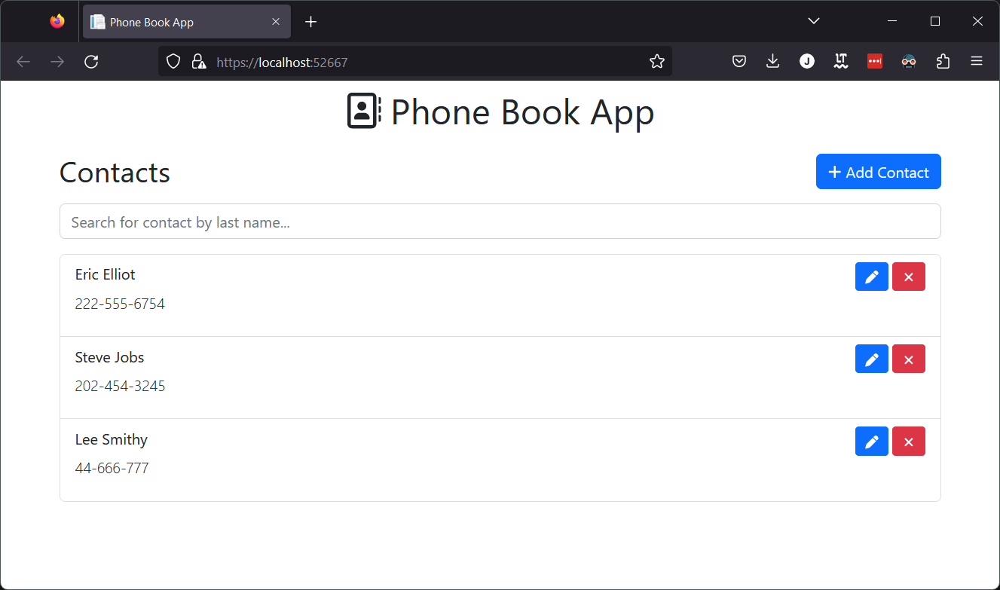
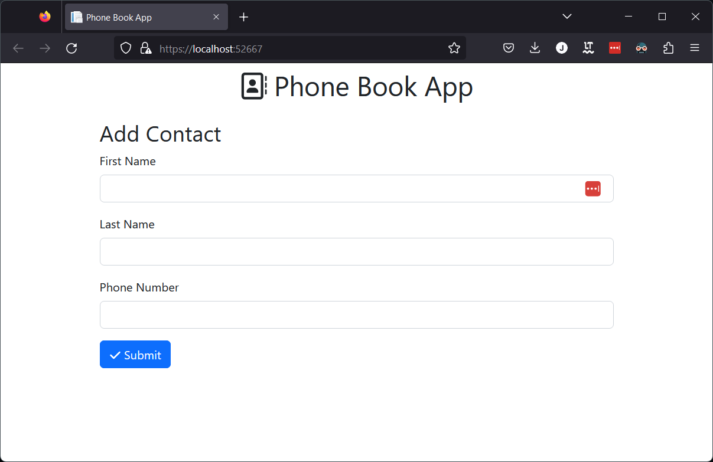

# WeDo: PhoneBook 🤵
A simple phone book application with CRUD operations.

[](https://github.com/jonny64bit/WeDoPhoneBook/actions/workflows/test.yml)

### Development Setup 🛠

##### Requirements

-   Visual studio 2022
-   Node v16.14.2
-   Docker

##### Steps

1. Open [WeDoPhoneBook.sln](src/WeDoPhoneBook.sln) file in Visual Studio
2. Install npm packages in [src/WeDoPhoneBook.Web/](src/WeDoPhoneBook.Web/)
```bash
npm install
```
3. Build front end in [src/WeDoPhoneBook.Web/](src/WeDoPhoneBook.Web/)
```bash
npm run build
```
4. Select docker-compose as the startup project and run. This will build/run the container for the website and a sql container. Ignore the propped up browser window for now.
5. Run DatabaseQuickCreateAndMigrate console application. This will bootstrap a development database with the correct seed data.
6. Refresh the browser window to run the application with setup seed data.

### Pages 📃

#### Phone Book



#### Phone Book - Edit/Add



### Notes ✏

- Missing security hardening or any authentication
- Only got default BS5 theme
- Validation would need to added